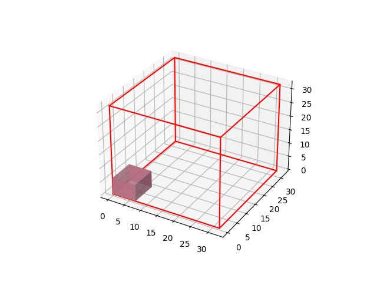
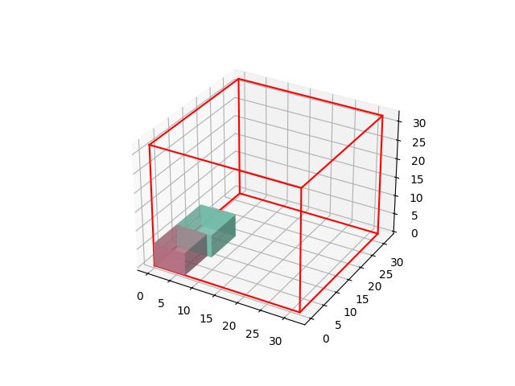
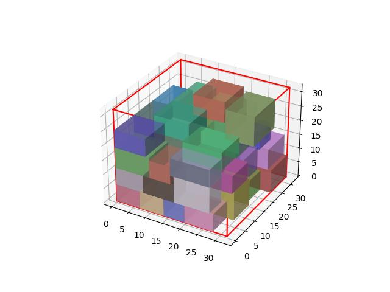

# DeepPack3D
**DeepPack3D** is a Python-based 3D bin-packing software optimized for robotic palletization systems. It supports various methods, including reinforcement learning (RL) and heuristic baselines, and provides flexible options for data input and visualization.



## Features
- Supports multiple methods: Reinforcement Learning (**RL**), Best Lookahead (**BL**), Best Area Fit (**BAF**), Best Shortest Side Fit (**BSSF**), and Best Longest Side Fit (**BLSF**).
- Provides options for data generation, user input, or loading from a file.
- Offers training and testing modes for RL.
- Includes visualization to monitor the packing process.
- GPU-enabled for accelerated RL training and inference.

## Installation
The software runs in **Python 3.10** and **Tensorflow 2.10.0**.

You can refer to Tensorflow official website for the installation guideline.
> https://www.tensorflow.org/install

### From repository
1. Clone the repository:
```bash
git clone https://github.com/zgtcktom/DeepPack3D.git  
cd DeepPack3D
```

2. Install dependencies:
```bash
pip install -r requirements.txt
```

3. Ensure you have a compatible GPU environment if using RL methods.

### From wheel
Alternatively, you can create a distributable package.

1. Creating a wheel
```bash
python setup.py sdist bdist_wheel
```

2. Install wheel
```bash
pip install ./dist/DeepPack3D-0.1.0-py3-none-any.whl
```

3. Run python module
```bash
python -m deeppack3d rl 5 --n_iterations=-1 --data=file --path=./input.txt --verbose=1
```

## Usage
### Command-Line Interface
You can run DeepPack3D directly from the command line:

```bash
python deeppack3d.py <method> <lookahead> [options]
```
#### Example Command:
```bash
python deeppack3d.py bl 5 --n_iterations=-1 --data=file --path=./input.txt --verbose=1
```

#### Arguments:
- `<method>`: Choose the method from `{"rl", "bl", "baf", "bssf", "blsf"}`.
- `<lookahead>`: Set the lookahead value.

#### Options:

- `--data`: Input source (`generated`, `input`, or `file`). 
    - Default: `generated`.
- `--path`: File path (used only if `--data=file`). 
    - Default: `None`.
- `--n_iterations`: Number of iterations (used only if `--data=generated`). 
    - Default: `100`.
- `--seed`: Random seed for reproducibility (used only if `--data=generated`). 
    - Default: `None`.
- `--verbose`: Verbose level (`0` for silent, `1` for standard, `2` for detailed). 
    - Default: `1`.
- `--train`: Enable training mode (used only with `method=rl`). 
    - Default: `False`.
- `--batch_size`: Batch size (used only with `--train`). 
    - Default: `32`.
- `--visualize`: Enable visualization mode. 
    - Default: `False`.

### Library
You can also import DeepPack3D as a Python library to integrate with other systems or workflows.

Example:
```python
from deeppack3d import deeppack3d

for result in deeppack3d('rl', 5, n_iterations=-1, data='file', path='./input.txt', verbose=0):
	if result is None:
	 	print('new bin')
		continue
	_, (x, y, z), (w, h, d), _ = result
	print(f'placing item ({w}, {h}, {d}) at ({x}, {y}, {z})')
```

## Contributing
Contributions are welcome! Feel free to open issues or submit pull requests to improve the software.

## License
This project is licensed under the MIT License. See the LICENSE file for details.